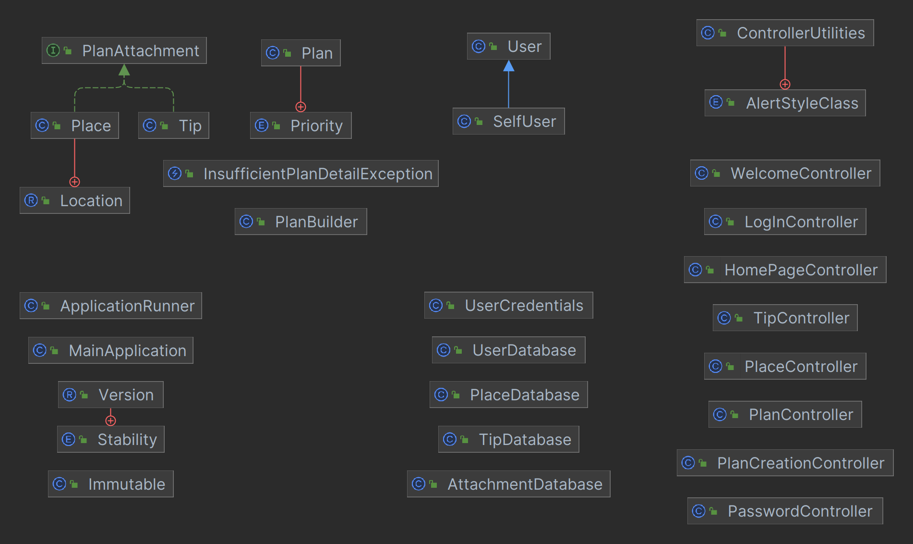
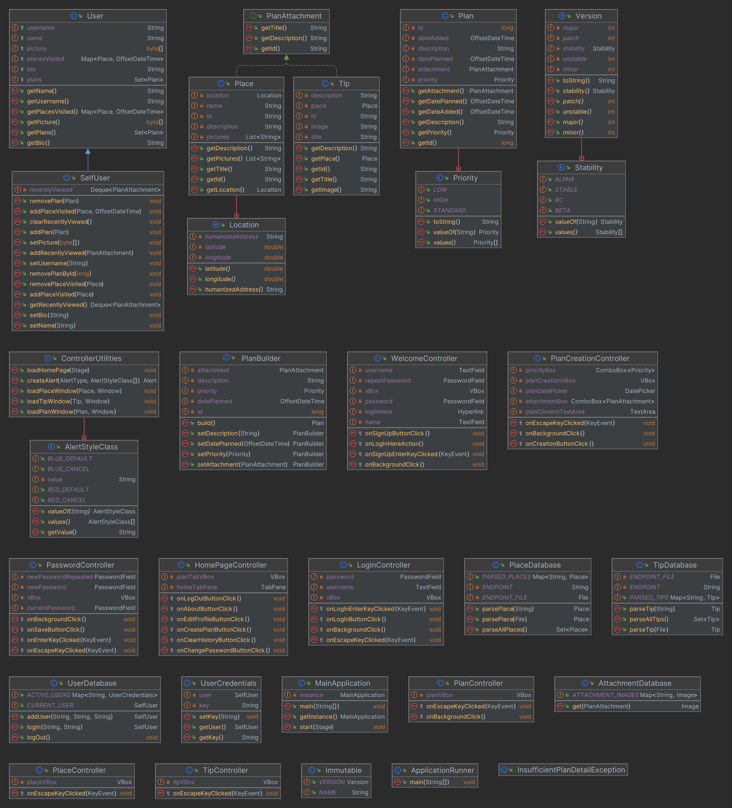

# UML Diagrams
## Class Diagram Illustration
The following diagram has been automatically generated by IntelliJ IDEA:\

Full class diagram:\

## Class Description
* Entity classes:
  * Plan - contains all the plan data used in the program (e.g., the plan's priority, deadline, description, etc.)
    * Priority - an enum of degrees of a plan's priority
  * *PlanAttachment* - an interface object that can be used as an attachment inside a plan
    * Place - contains data about a sight in the city
      * Location - contains information about location of a place (e.g., the place's humanized address and geographical coordinates)
    * Tip - contains data about advice for traveling in the city
  * User - stores all the data about an application user
    * SelfUser - allows to modify the currently logged-in user's data
* Builder classes:
  * PlanBuilder - used to create an instance of the Plan object
* Exception classes:
  * InsufficientPlanDetailException - used in case a plan cannot be created due to an insufficient amount of data provided
* Database classes:
  * AttachmentDatabase - used mainly for caching JavaFX images of plan attachment objects (i.e., Tips and Places)
  * PlaceDatabase - used for parsing place data into a Place object
  * TipDatabase - used for parsing tip data into a Tip object
  * UserDatabase - used for operating user profiles
  * UserCredentials - used for simulation of storing a user's security data in a database
* GUI classes:
  * ControllerUtilities - contains a number of essential GUI methods (e.g., home page dynamic loading, alert styling, place/tip/plan window loading, etc,)
    * AlertStyleClass - an enum of pre-defined alert button CSS styles
  * Individual window controllers:
    * HomePageController
    * LogInController
    * PasswordController
    * PlaceController
    * PlanCreationController
    * TipController
    * WelcomeController
* Running classes:
  * Version - used for better program version organization
    * Stability - specifies the version's suffix (e.g., ALPHA, BETA, RC, etc.)
  * Immutable - contains a number of static fields used all over the program (e.g., the app's title, the version, etc.)
  * MainApplication - extends JavaFX Application, creates a starting window
  * ApplicationRunner - the program's main class (which is also provided as the main class while generating a JAR file)